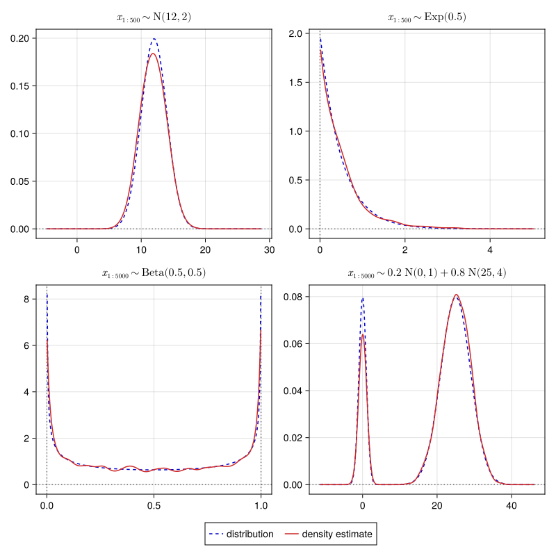

| **Documentation**                                                         | **Build Status**                                     |
|:-------------------------------------------------------------------------:|:----------------------------------------------------:|
| [![][docs-stable-img]][docs-stable-url] [![][docs-dev-img]][docs-dev-url] | [![][ci-img]][ci-url][![][codecov-img]][codecov-url] |

# Kernel Density Estimation

`KernelDensityEstimation.jl` is a package for calculating univariate (1D) kernel density estimates from vectors
of data.
Its main features (and limitations) are:

- Uses a Gaussian kernel for smoothing (truncated at ``4σ``).
- Supports closed boundaries.
- Provides higher-order estimators to better capture variation in width and slope of distributions.
- A more sophisticated bandwidth estimator than the typical Silverman rule.
- Limited to 1D curves — does **not** support 2D densities.

This package largely implements the algorithms described by Lewis (2019)[^1]
(and its corresponding Python package, [GetDist](https://pypi.org/project/getdist/)).

[^1]: A. Lewis. _GetDist: a Python package for analysing Monte Carlo samples_, (2019)
      arXiv: [1910.13970](https://doi.org/10.48550/arXiv.1910.13970).

---

[docs-stable-img]: https://img.shields.io/badge/docs-stable-blue.svg
[docs-stable-url]: https://jmert.github.io/KernelDensityEstimation.jl/stable
[docs-dev-img]: https://img.shields.io/badge/docs-dev-blue.svg
[docs-dev-url]: https://jmert.github.io/KernelDensityEstimation.jl/dev

[ci-img]: https://github.com/jmert/KernelDensityEstimation.jl/actions
[ci-url]: https://github.com/jmert/KernelDensityEstimation.jl/workflows/CI/badge.svg

[codecov-img]: https://codecov.io/gh/jmert/KernelDensityEstimation.jl/branch/master/graph/badge.svg
[codecov-url]: https://codecov.io/gh/jmert/KernelDensityEstimation.jl

