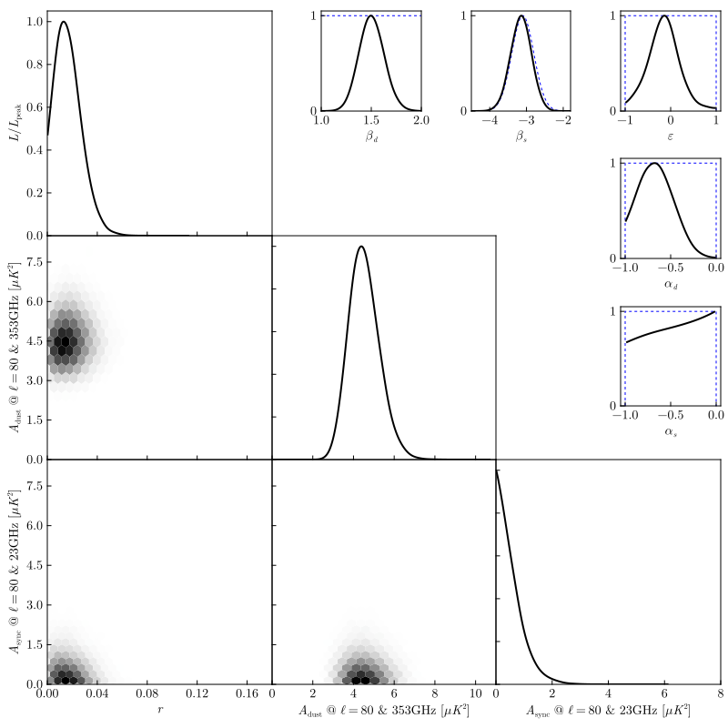

# CosmoMC Weighted Chains (BK18 baseline likelihood analysis)

The figure below is to be compared to [Figure 4 from BICEP/Keck paper XIII](http://bicepkeck.org/figures/bk-xiii.html).

After loading the appropriate columns from the set of MCMC chains and thinning, performing the kernel density estimation
is as simple as:

```julia
K_r  = kde(chain_r;  weights = chain_weight, lo =  0.0,            boundary = :closedleft)
K_Ad = kde(chain_Ad; weights = chain_weight, lo =  0.0,            boundary = :closedleft)
K_As = kde(chain_As; weights = chain_weight, lo =  0.0,            boundary = :closedleft)
K_βd = kde(chain_βd; weights = chain_weight, lo =  0.8, hi =  2.4)
K_βs = kde(chain_βs; weights = chain_weight, lo = -4.5, hi = -2.0)
K_αd = kde(chain_αd; weights = chain_weight, lo = -1.0, hi =  0.0, boundary = :closed)
K_αs = kde(chain_αs; weights = chain_weight, lo = -1.0, hi =  0.0, boundary = :closed)
K_ε  = kde(chain_ε;  weights = chain_weight, lo = -1.0, hi =  1.0, boundary = :closed)
```



Note that because this package does not support constructing 2D density estimates, the 68% and 95% confidence
"ellipses" in the lower-left triangle of the plot has been replaced with simple 2D histograms.
The hex bin sizes have been chosen using 2× the automatically-determined bandwidths of the corresponding 1D curves.

```@eval
Main.@showcase_source
```
