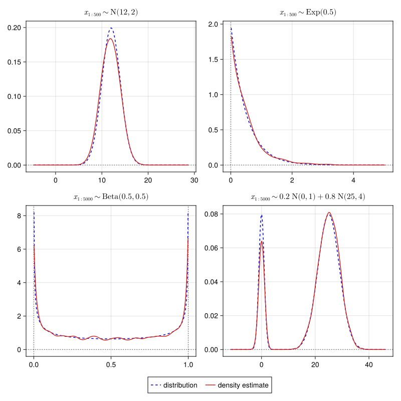

# [Simple distributions](@id showcase_simple)



## Source Code

````@eval
import Markdown
sourcecode = read(joinpath(dirname(@__FILE__), "distributions.jl"), String)
Markdown.parse("""
```julia
$sourcecode
```
""")
````

